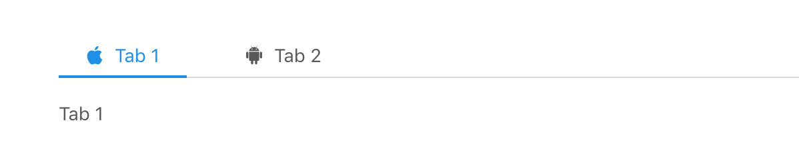

## DOM操作
1，写一个列表，列表为15个，奇数行为黄色，偶数行位绿色
2，点击列表的某个项，alert出对应的位置数
3，添加一个删除按钮，然后添加一个input，input输入number然后可以点击删除按钮指定删除对应的列表内某一个项，
输入的不是number或者超出列表范围，alert对应信息
4，依赖第三步，添加一个重置按钮，将删除的DOM重新添加回去

## 字符串操作
1, 'qwerts' 转换成 `["q", "w", "e", "r", "t", "s"]` 数组
2, 'qwerts' 转成大写 "QWERTS"
3, 'qwerts' 截取 "q"

## 数字操作
1， Number('1231qwe') // 输出什么
答：Number('1231qwe') //=>输出NaN
2， parseInt 和 parseFloat 的区别
答：parseInt的提取规则是：从左至右依次查找有效数字字符，直到遇见非有效数字字符为止（不管后面是否还有，都不再继续找下去）把找到的转换为数字。parseFloat是指在parseInt的基础上可以识别小数点。
3，'123123.889990000' 保留两位小数
4， 写一个随机方法，可以取 23-72 的随机数
5，在js内 0.1 +0.2 = 0.3 ?  为什么？
答：因为它们是number类型
6， NaN === NaN ？
答：false  因为NaN是指not a Number 不是一个数字，代表非数字值的特殊值。
## 操作时间
将js获取到的当前时间转换成这种格式的字符串 'xxxx年xx月xx日上午（或下午）xx时xx分xx秒'

## 数组
```js
var list = [1,,2,23,123,23,21,2]
```
1, list 的第二项值是什么
答：第2项的值？数组按照从零排列 第二项是23.
2，删除数组第一位
 答：list.shift():删除数组第一项
3， 删除最后一位
答：list.pop()删除数组最后一项
4，添加数字5到第一位
答：list.unshift(5) ->添加数字5到第一项
5，添加到到第三位和第四位中间
答：list.splice(2,0,8) ->添加到第三位后面
6，删除数组的第三项后两个数字
答：list.splice(3,4) ->
7，第一位和最后一位数字调换位置
8，前后翻转数组
答：list.reverse()前后翻转数组。
9，对数组从大到小排序
答：list.sort()从小到大排列，这是可以给10以内的数字

## object
```js
var obj = {a:'x',c:'12',d:3, 1:'qwe'}
```
1, 遍历出obj的每一项的值
答：for (var key in obj){
    alert(obj);
}
2, console.log取出obj内key为1的那项的值
答：console.log(key=1,obj);//->key为1的那项值

## 算法排序
1，写一个冒泡排序，并说明原理
2，更多排序方法及其原理

## 写一个选项卡
